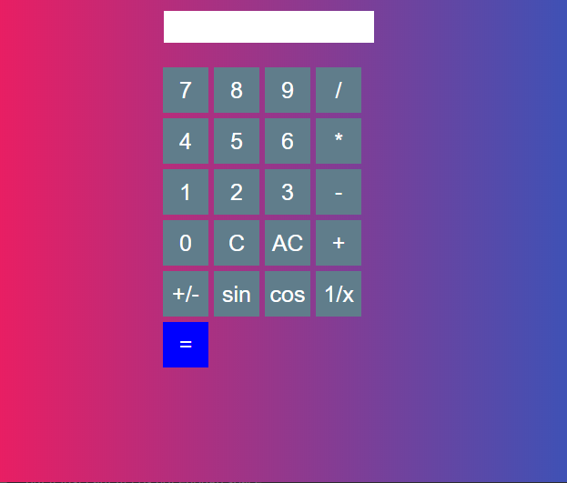
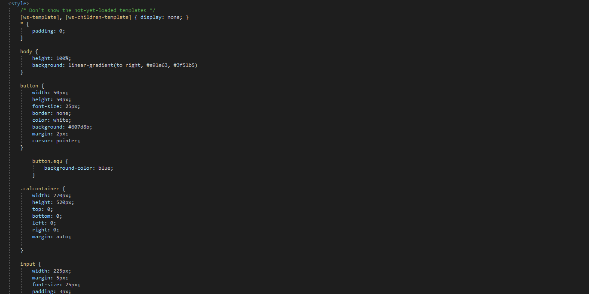
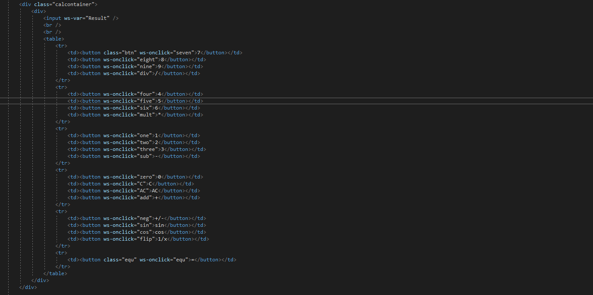
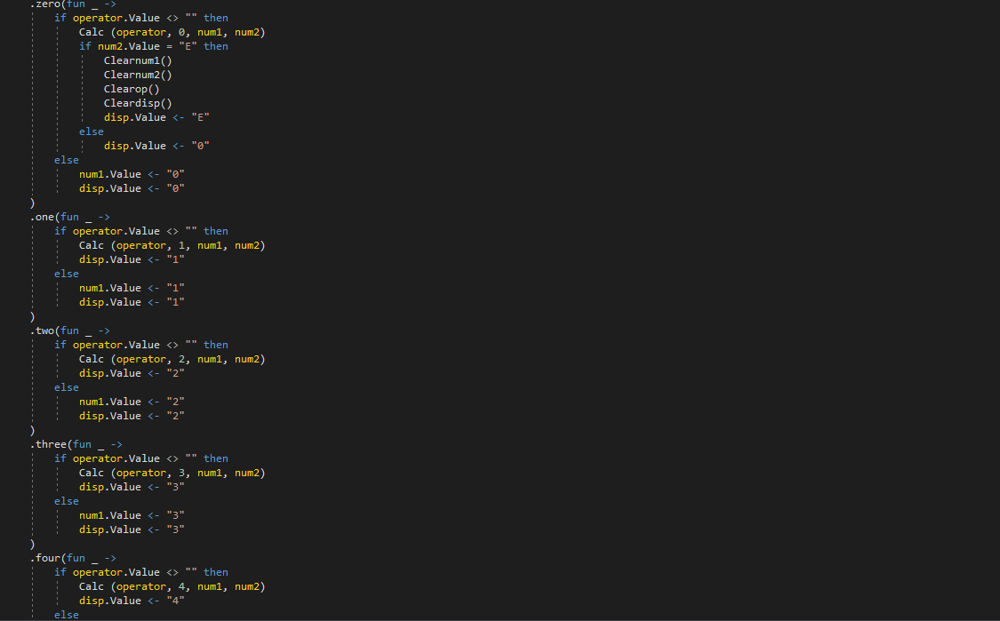
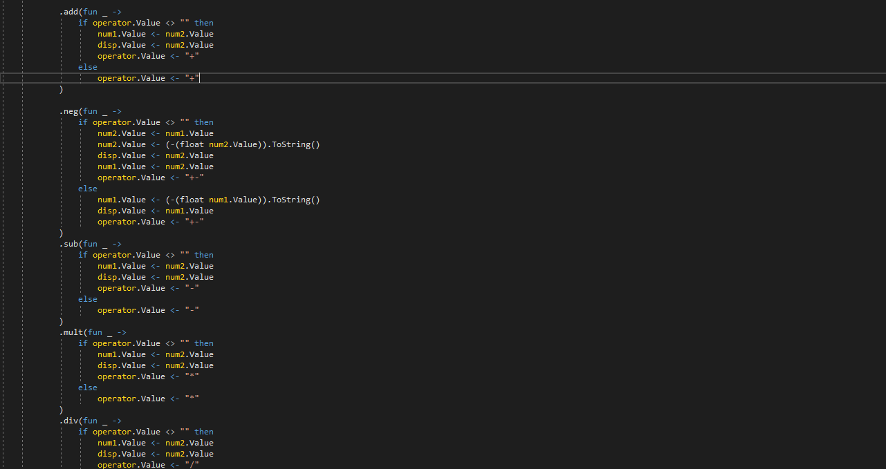
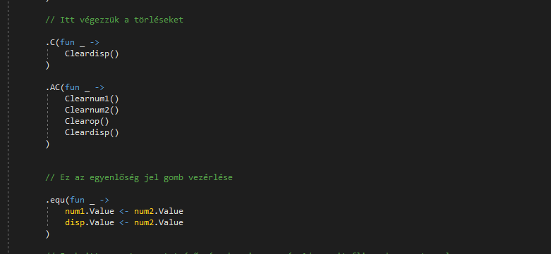
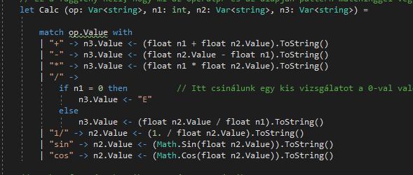
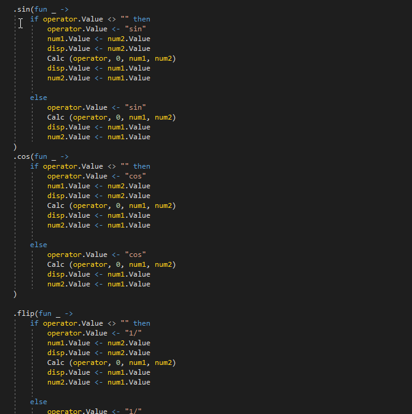

# Websharper calculator - Midterm No.1

Ez a project a websharperes calculator, az első beadandó a 3 midterm beadandó közül. A Project **Visual Studio**-ban íródott, a template: **Websharper 4 Single Page Application (.NET Core)**

A befejezett project kinézete:

# Fontos file-ok

A legfontosabb két file az **index.html** és a **Client.fs** file, előbbi a html file, utóbbi a code behind F#-ban írva.

# Index.html

## Styling
Az egyik fontos rész a style, ami simán a html kód `<style>` tag-jei között található:

## A számológép elemei
Illetve maga a számológép, amit én egy táblázatként raktam össze, amibe tettem egy **text input**-ot és **button** -okat amik a működésért felelősek:

# Client.fs

Ezt a filet igazából 5 részre bontanám:
- A szám gombokat kezelő kódrészlet
- Az operátorokat kezelő kódrészlet
- Az egyenlóséget és törlést kezelő kódrészlet
- A pattern matching ami a műveletet elvégzi
- Az extra függvények mint a sin, cos és 1/x

Nézzünk ezekre kódrészleteket egyenként!

## Szám gombok

## Operátor gombok

## Egyenlő, C és AC gombok

## Műveletvégző pattern matching

## Extra fv-ek, sin, cos, 1/x

